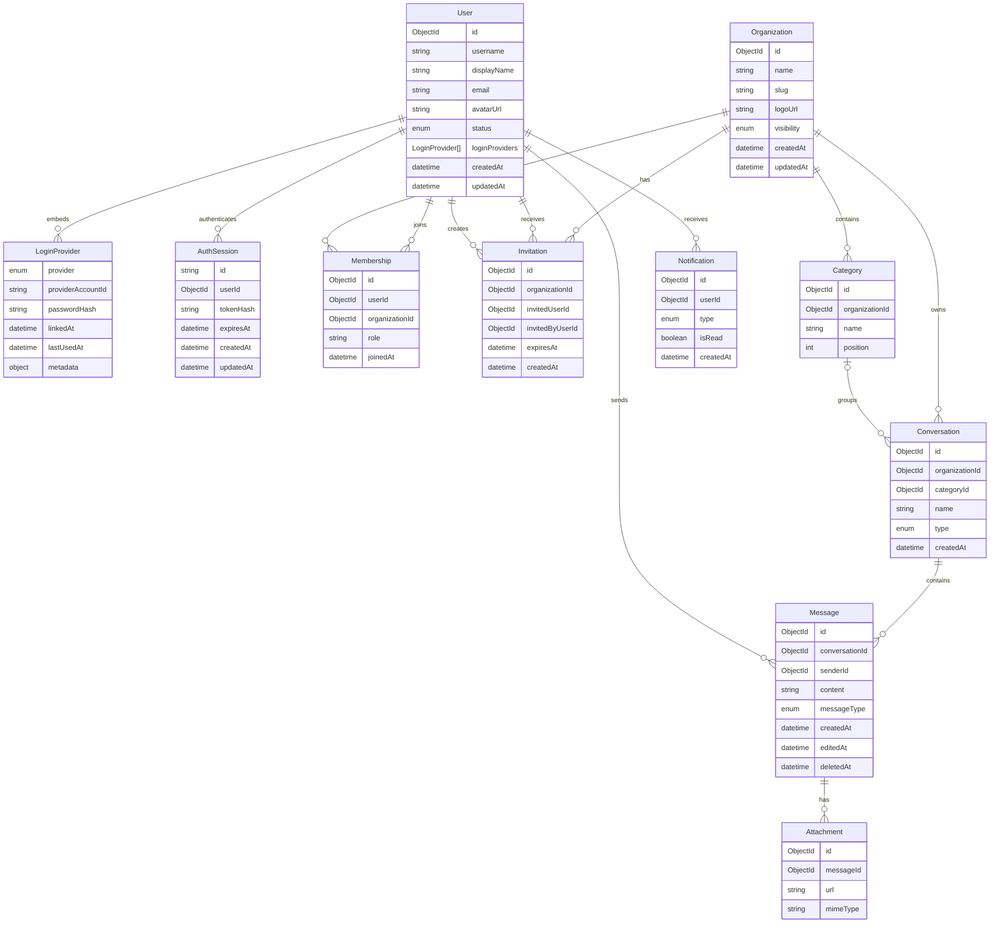

`LoginProvider.providerAccountId` stores the Google `sub` for Google identities.
The pair of `provider` and `providerAccountId` is uniquely indexed across users.

Organization ownership is represented only by an `OWNER` membership. The
organization document does not duplicate ownership with an `ownerId` field.
Memberships are unique by `(organizationId, userId)`, and a partial unique index
on `(organizationId, role)` permits at most one `OWNER` membership per
organization. Organization creation and deletion maintain the required owner
membership in the same MongoDB transaction.

Invitation documents represent pending invitations only. They are unique by
`(organizationId, invitedUserId)`, expire after seven days, and are deleted when
accepted, declined, or when the organization is deleted.
