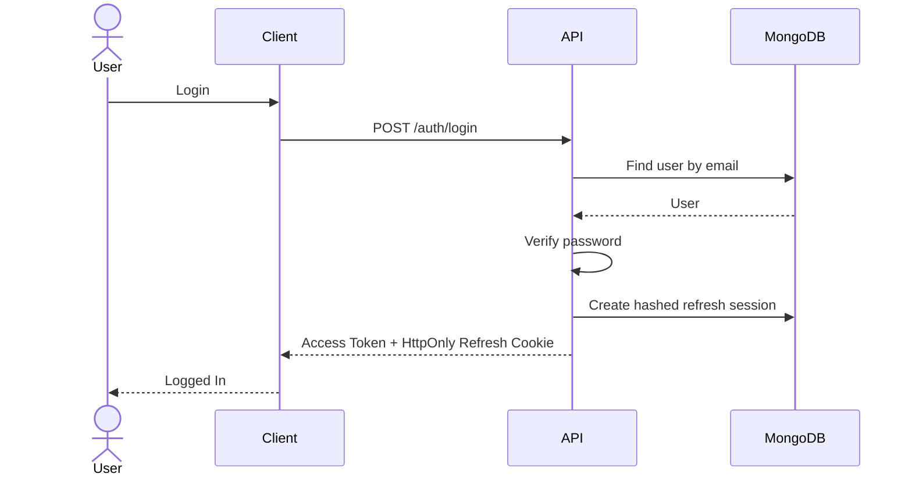

```mermaid
sequenceDiagram

    actor User

    participant Client

    participant API

    participant MongoDB

    User->>Client: Login

    Client->>API: POST /auth/login

    API->>MongoDB: Find user by email

    MongoDB-->>API: User

    API->>API: Verify password

    API->>MongoDB: Create hashed refresh session

    API-->>Client: Access Token + HttpOnly Refresh Cookie

    Client-->>User: Logged In
```
