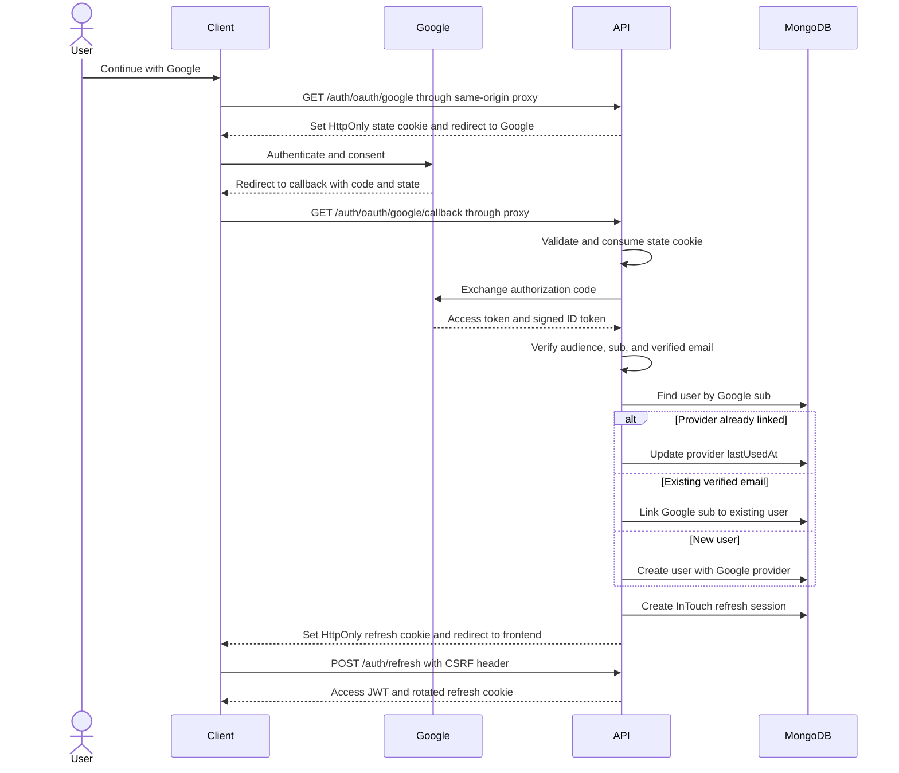

```mermaid
sequenceDiagram
    actor User
    participant Client
    participant Google
    participant API
    participant MongoDB

    User->>Client: Continue with Google
    Client->>API: GET /auth/oauth/google through same-origin proxy
    API-->>Client: Set HttpOnly state cookie and redirect to Google
    Client->>Google: Authenticate and consent
    Google-->>Client: Redirect to callback with code and state
    Client->>API: GET /auth/oauth/google/callback through proxy
    API->>API: Validate and consume state cookie
    API->>Google: Exchange authorization code
    Google-->>API: Access token and signed ID token
    API->>API: Verify audience, sub, and verified email
    API->>MongoDB: Find user by Google sub

    alt Provider already linked
        API->>MongoDB: Update provider lastUsedAt
    else Existing verified email
        API->>MongoDB: Link Google sub to existing user
    else New user
        API->>MongoDB: Create user with Google provider
    end

    API->>MongoDB: Create InTouch refresh session
    API-->>Client: Set HttpOnly refresh cookie and redirect to frontend
    Client->>API: POST /auth/refresh with CSRF header
    API-->>Client: Access JWT and rotated refresh cookie
```

Google access and refresh tokens are not persisted. The Google `sub` claim is
the stable provider identity; verified email is used only to link an unlinked
identity to an existing InTouch user.
